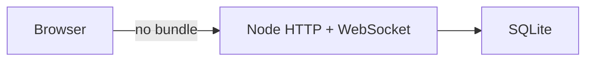

# ADR 0001: Build-free clients and one Node service

**Status:** Accepted

**Decision:** Ship plain HTML/CSS/JavaScript and run static serving, REST, and
WebSockets in one dependency-light Node process.

**Consequences:** Static previews remain useful and deployment is small; browser
globals and a central server router replace module bundling and framework
boundaries, so larger changes need disciplined tests.

