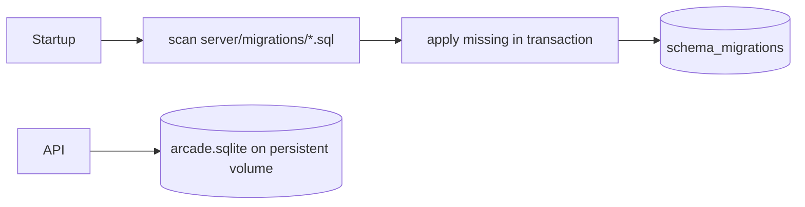

# ADR 0002: SQLite with ordered migrations

**Status:** Accepted

**Decision:** Persist accounts, sessions, results, and achievement progress in a
single SQLite file on a mounted volume. Apply immutable, filename-ordered SQL
migrations transactionally at startup.

**Consequences:** Backup and NAS operation are simple and no database service is
needed; the single-node design is not intended for horizontally scaled writers.

