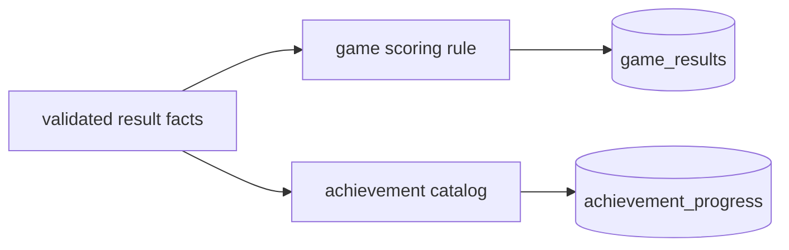

# ADR 0003: Server-derived scores and catalog-driven achievements

**Status:** Accepted

**Decision:** Accept bounded game facts rather than arbitrary scores. Derive
scores centrally, then evaluate an in-code achievement catalog in the same
result flow. The authoritative Battle Tanks room writes online results directly.
For Battle Tanks solo results, only the human Player 1 aggregates contribute to
the result, and a CPU victory derives a score of zero; CPU performance can never
inflate a player's leaderboard entry.

**Consequences:** Leaderboards use comparable values and rules are testable;
client-reported results still require plausibility validation and catalog changes
are deployments rather than data administration.

