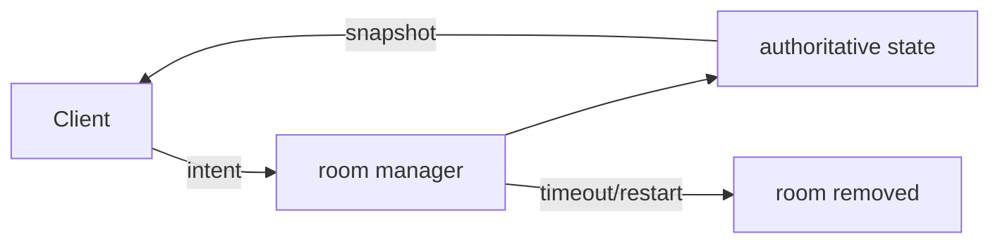

# ADR 0004: Authoritative, ephemeral online rooms

**Status:** Accepted

**Decision:** Keep rooms in process. Clients send intent; room managers validate
lifecycle and game commands, while servers own online state (including real-time
Pong and Battle Tanks simulation). Expire abandoned rooms and allow short token-
based reconnection.

**Consequences:** Players converge on one state without room persistence or
cleanup jobs; matches do not survive process restart and one process owns every
active room.

