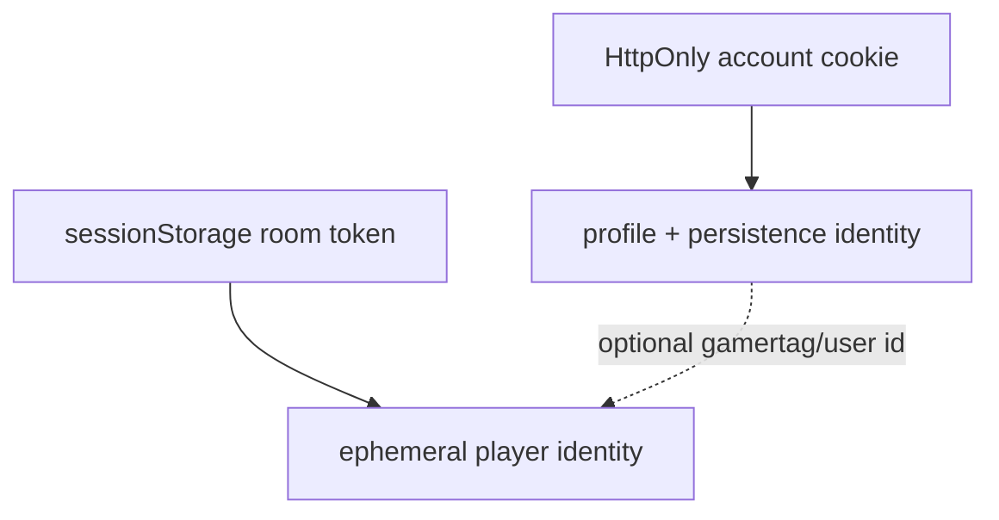

# ADR 0005: Separate opaque account and room sessions

**Status:** Accepted

**Decision:** Store only hashed random account-session tokens and deliver the raw
token in an HttpOnly cookie. Give each online-room player a separate opaque
resume token held in browser session storage.

**Consequences:** Room play does not require an account and scripts cannot read
account credentials; room tokens remain script-visible and are intentionally
short-lived with the room.

