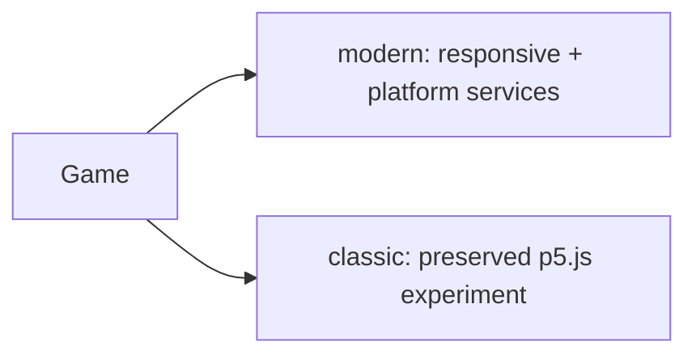

# ADR 0006: Preserve classic games beside modern games

**Status:** Accepted

**Decision:** Keep original p5.js implementations under each game's `classic/`
path while modern implementations use the shared arcade shell. Do not retrofit
classic versions with accounts or online services.

**Consequences:** Original learning artifacts remain playable and modern work can
evolve independently; behavior and external p5.js availability differ by version.

