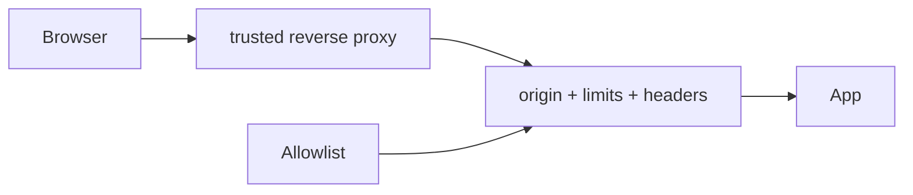

# ADR 0007: Same-origin deployment with layered HTTP security

**Status:** Accepted

**Decision:** Serve pages, API, and WebSockets from one origin behind HTTPS.
Validate origins (with an explicit allowlist), rate-limit sensitive actions, cap
payloads, set restrictive headers, hide private paths, and trust proxy headers
only when configured.

**Consequences:** Cookies and invitation URLs stay simple and the attack surface
is constrained; split-origin clients require configuration and proxy trust must
match the actual network boundary. Modern pages execute scripts only from the
arcade origin. Resolved assets belonging to preserved classic p5.js pages receive
a scoped cdnjs exception, while inline scripts, plugin objects, frames, and
foreign form targets remain blocked. Production session and deletion cookies
always carry the `Secure` attribute; development deployments may opt into it but
cannot opt production out.

