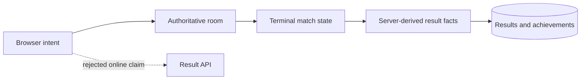

# ADR 0016: Authoritative online result recording

**Status:** Accepted

**Decision:** Pong, tic-tac-toe, and Battle Tanks room managers record online
results directly from their terminal authoritative state. Account identity is
captured when an authenticated player creates or joins a room and remains bound
to that room player across reconnects. Each room records at most once per match.
The ordinary result API rejects every client submission that claims an online
mode.

**Consequences:** Signed-in players receive online history, scores, and
achievements without trusting browser-authored outcomes. Anonymous players can
still participate but do not receive persistent results. Reconnects, repeated
snapshots, concurrent rematch requests, and persistence failures cannot create
duplicate records or interrupt room simulation. Solo and local browser games
continue to submit bounded facts under ADR 0003.
