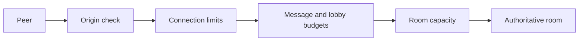

# ADR 0017: Bounded WebSocket and room resources

**Status:** Accepted

**Decision:** Apply layered availability limits before and after WebSocket
upgrade. Bound concurrent connections globally and per client address, messages
per socket, lobby actions per address, active rooms globally/per game/per
address, and public room-list responses. Check room capacity before allocating
game state. Derive client addresses through the same explicitly configured proxy
boundary as authentication throttling.

The defaults permit 250 concurrent sockets, 20 sockets per address, 300
messages per socket per ten seconds, 10 room creations and 60 joins per address
per minute, 200 rooms across the arcade, 100 rooms per game, 5 rooms per
address, and 50 entries per public listing. Deployments may lower or raise these
limits through documented environment variables.

**Consequences:** A remote peer cannot allocate unbounded sockets, rooms, game
state, broadcast work, or lobby responses. Limits are intentionally
process-local because rooms are process-local. Multi-instance deployments need
proxy-level limits and shared admission state before rooms can be distributed.
Incorrect proxy trust can collapse clients onto one address or permit spoofing,
so the existing trusted-proxy deployment constraint remains part of this
boundary.
