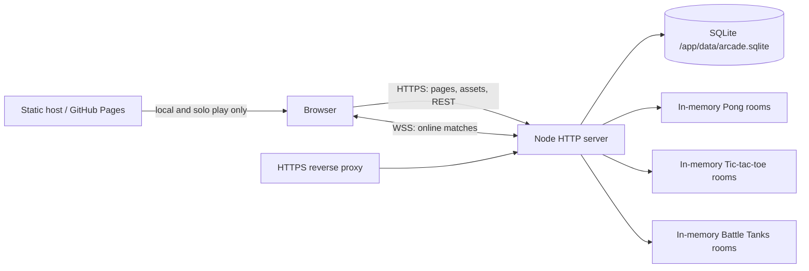
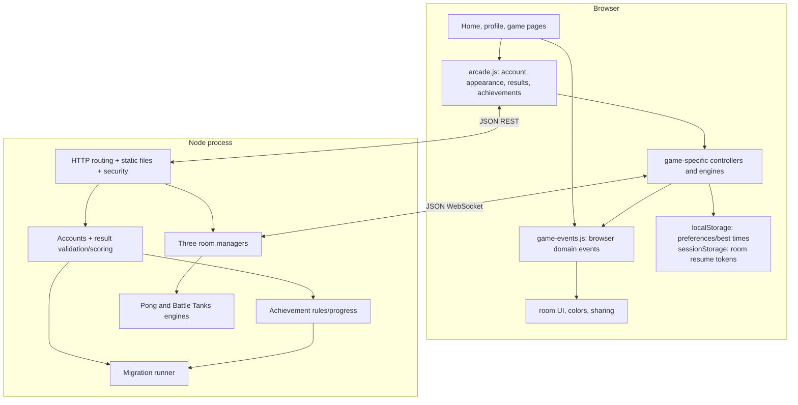
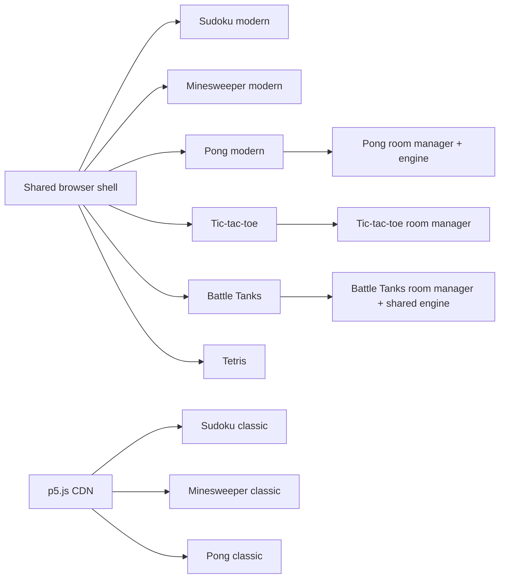
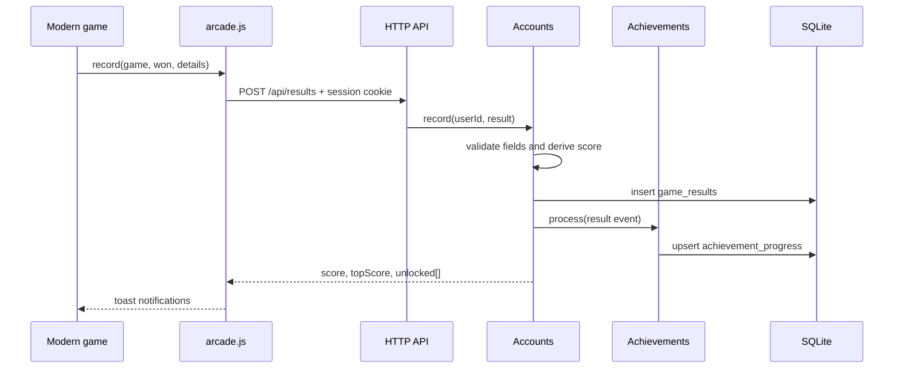
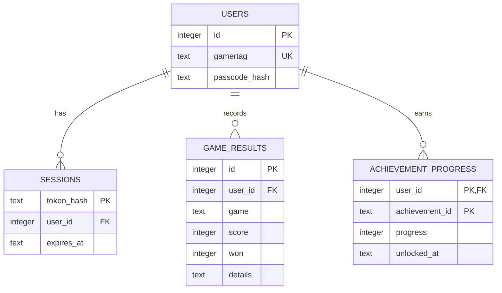
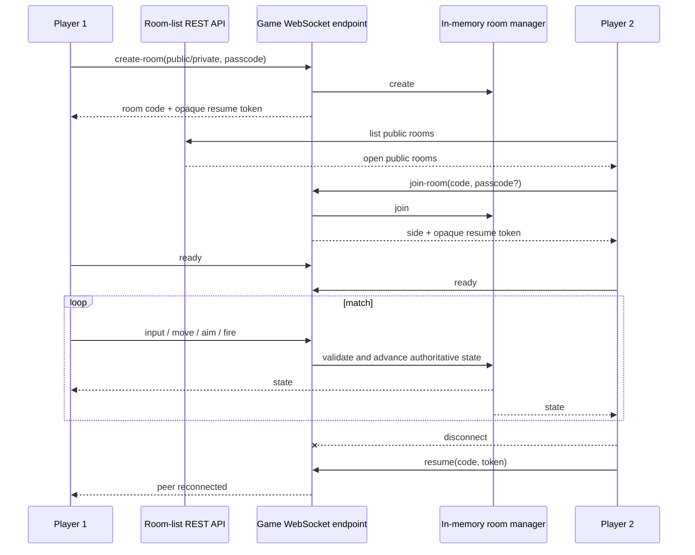
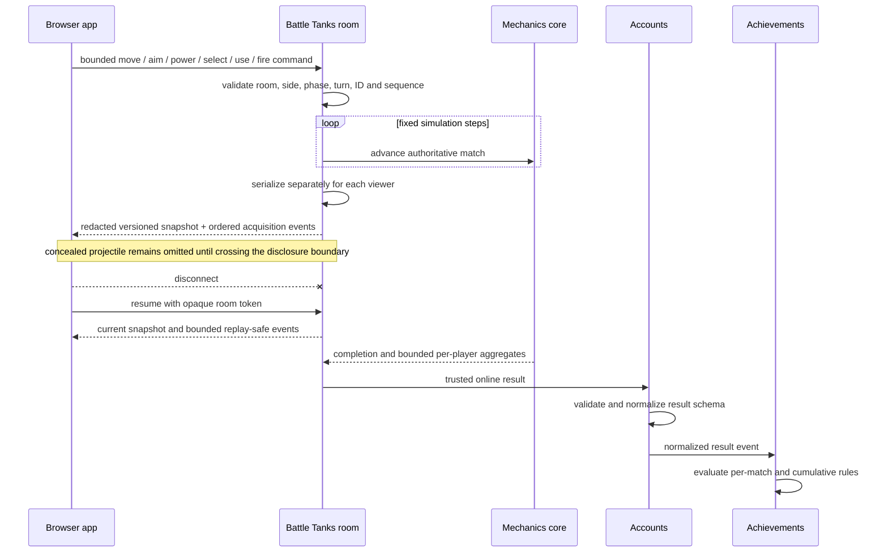
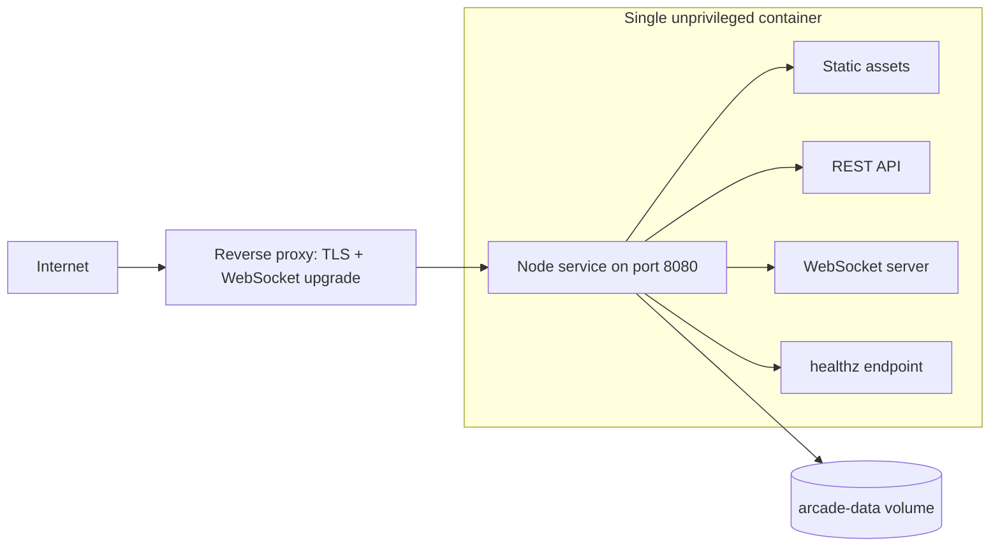

# Current architecture

The arcade is a build-free browser application plus one Node.js process. The
process serves the same files used by static hosting, exposes the account API,
and hosts optional online matches. Classic games are intentionally standalone.

## System topology

## Appearance system

`theme-init.js` applies appearance before first paint and publishes the shared
theme registry. Experience (`playful`, `cabinet`, or `calm`) is independent
from the `system`/`light`/`dark` color preference. `arcade.js` renders the
appearance dialog, persists changes, synchronizes tabs, and emits the
`system:theme-changed` domain event for DOM and canvas games. Shared component and layout
tokens live in `arcade.css` and `styles/modern-game.css`; homepage and profile
styles consume the same root attributes for their page-specific layouts.

The shared shell also owns the progressive-web-app install surface. It points
modern pages at the root arcade manifest, uses the browser's native install
prompt when offered, provides platform-specific manual steps on Apple and
Android browsers, and suppresses the hint when already installed. Its root
service worker uses network-first static caching while excluding APIs. See
[ADR 0012](adr/0012-shared-app-install-surface.md).

See [ADR 0008](adr/0008-experience-theming-system.md) for the decision and
extension constraints.

## Audio system

Modern game pages load `scripts/game-events.js` and then `scripts/audio.js`
before the shared shell. Game controllers publish gameplay facts and lifecycle
state without referencing audio. The audio adapter subscribes to those facts,
creates a Web Audio graph only after gameplay interaction, and synthesizes all
music and effects without media assets. `arcade.js` owns the persistent master
mute, discoverable sound presets, and independently persistent music/effects
levels. Experience themes select shared timbres;
individual game scripts never branch on theme names. Hidden pages and non-audio
dialogs suspend background music, and online clients deduplicate transition
events independently from authoritative state. See [ADR 0013](adr/0013-procedural-arcade-audio.md), the
[audio design](audio-design.md), the [player-facing audio guide](audio.md), and
[ADR 0015](adr/0015-audible-sound-mixer.md) for the audible mixer exception.

## Browser event system

`scripts/game-events.js` provides a synchronous, page-local semantic event bus
for optional browser features. Games publish accepted actions and lifecycle
facts; audio and shared shell features subscribe without entering the mechanics
boundary. The shell also publishes theme, account, validated achievement,
validated top-score, and audio-preference changes. Events are immutable
notifications, not commands or trusted records. Server-derived results,
achievement progress, and authoritative online rooms remain outside this bus.
See [ADR 0014](adr/0014-browser-domain-event-bus.md) and the
[extension guide and event contract](game-events.md).

## Games and components

| Game | Browser modes / components | Online authority | Platform integration |
|---|---|---|---|
| Sudoku | Modern controller with generated boards, notes, hints and solver; separate p5.js classic (`board`, `cell`, `builder`, `solver`, `sketch`) | None | Modern results, scores and achievements |
| Minesweeper | Modern controller plus tile/grid engine; separate p5.js classic (`sketch`, `tile`) | None | Modern results, browser best times, scores and achievements |
| Pong | Modern canvas controller + motion prediction; solo, couch duo, online; separate p5.js classic (`board`, `ball`, `sketch`) | Server engine at 60 Hz; snapshots at 30 Hz | Modern results, scores and achievements |
| Tic-tac-toe | Modern controller, minimax AI, couch duo and online | Room manager validates turns, cells and wins | Results, scores and achievements |
| Battle Tanks | Shared deterministic engine + canvas controller; solo CPU, local duo and online | Server validates commands and owns physics, damage, turns and online result recording | Results, scores and achievements |
| Tetris | Modern DOM controller plus testable seven-bag/SRS mechanics engine; endless solo marathon | None | Results, scores, history and achievements |

Tetris keeps mechanics independent from DOM presentation, submits bounded
top-out aggregates for server-derived scoring, and consumes a scoped theme-token
interface. At phone widths, the controller's board and status rail use an
approximately 70/30 viewport-aware layout while the touch controls remain
available. Line-clear and live-record celebrations are non-authoritative,
non-blocking presentation driven by mechanics events and local best-score state.
Random magic breakers and motion-assisted stack compaction are mechanics-owned,
use validated score facts, and retain keyboard and button fallbacks for sensor
access. See [ADR 0010](adr/0010-tetris-marathon-integration.md),
[ADR 0011](adr/0011-tetris-random-power-ups.md), and the
[player guide](tetris.md).

The coding-challenge folders (`leetcode/`, `codeforces/`, `codewars/`) are
independent scripts, not arcade games or runtime components.

## Accounts, scores and achievements

Registration/login uses scrypt passcode hashes. A random session token is sent
only in an HttpOnly, SameSite=Strict cookie; only its SHA-256 hash is stored.
Profile changes revoke existing sessions and rotate the current one. Public
leaderboards and achievement catalogs are readable without login; history,
result recording, and profile updates require a session. API inputs are bounded,
rate-limited, origin-checked, normalized, and scored by the server.

## Online gaming

| Concern | Pong | Tic-tac-toe | Battle Tanks |
|---|---|---|---|
| Endpoint | `/ws` | `/ws/tictactoe` | `/ws/battle-tanks` |
| Client command | continuous paddle input | discrete cell move | versioned move/aim/fire command |
| State delivery | 30 Hz snapshots | after actions | 60 Hz physics; projectile snapshots capped at 25 Hz (typically about 20 Hz because the 40 ms throttle is sampled by a 60 Hz timer) |
| Result source | room manager records authenticated players | room manager records authenticated players | room manager records authenticated players |
| Shared lifecycle | public/private five-character rooms, ready, rematch, invitation, resume token, reconnection grace, inactivity expiry, heartbeat |

Rooms and resume tokens are ephemeral and vanish on expiry/restart. Account
sessions are separate from room identity: login adds a gamertag to a room, and
all room managers also associate the user id for trusted online result recording.
The public result API rejects browser submissions claiming an online mode; each
room persists its terminal state at most once per match.
See [online rendering](online-rendering.md) for snapshot smoothing, client-side
prediction, safeguards, and alternatives.

## Battle Tanks boundaries and flow

Battle Tanks uses one deterministic mechanics core with deliberately narrow adapters:

| Component | Responsibility |
|---|---|
| `battle-tanks/scripts/game.js` | Versioned match state, seeded generation, fixed-step mechanics, collision and deformation, registry-driven weapons and power-ups, obstacle-aware homing guidance, damage/effects, and bounded transition statistics. It contains no DOM, transport, or account trust decisions. |
| `battle-tanks/scripts/ai.js` | Deterministic browser-side movement and trajectory planning for the solo CPU. It repositions within shared movement bounds, evaluates legal shots from the new position, selects bounded grazes or near misses at a human-like rate, and never participates in online authority. |
| `server/battle-tanks-rooms.js` | Authoritative online command validation and orchestration, fixed-step ticking, room lifecycle, trusted result creation, and viewer-specific serialization/redaction. |
| `battle-tanks/scripts/app.js` | Canvas rendering, prominent projectile/impact feedback, local input/simulation, solo orchestration, bounded visual prediction, room commands, accessibility, controls, viewport-contained result/acquisition layers, and replay-safe presentation-event handling. Card dismissal remains browser-local; only online room/match watermarks persist across reconnects. |
| `server/accounts.js` | Result-schema trust boundary: rejects invalid modes, identifiers, bounds, and untrusted online submissions, then normalizes versioned result details. |
| `server/achievements.js` | Declarative evaluator for normalized result transitions and cumulative progress; it does not accept UI-authored claims. |

Reconnect sends current state, not a full event-history replay. The same core
runs solo and local matches in the browser, but only the room server is
authoritative for online state and statistics. Solo result aggregation excludes
CPU activity and assigns no player score to a CPU victory. See
[ADR 0009](adr/0009-authoritative-battle-tanks-simulation.md)
and the [player-facing rules](battle-tanks.md).

## Deployment and boundaries

The server blocks private source/data paths, applies response security headers
and a resolved-asset-aware Content Security Policy,
checks HTTP/WebSocket origins, caps JSON and WebSocket payloads, and uses a
heartbeat. WebSocket admission also bounds connections, messages, lobby
actions, active rooms, and public listings before unauthenticated work can grow
without limit. Startup applies ordered SQL migrations transactionally. Graceful
shutdown closes sockets and SQLite. See the [decision index](adr/README.md) for
the trade-offs behind these boundaries.
