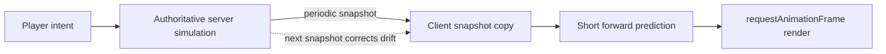
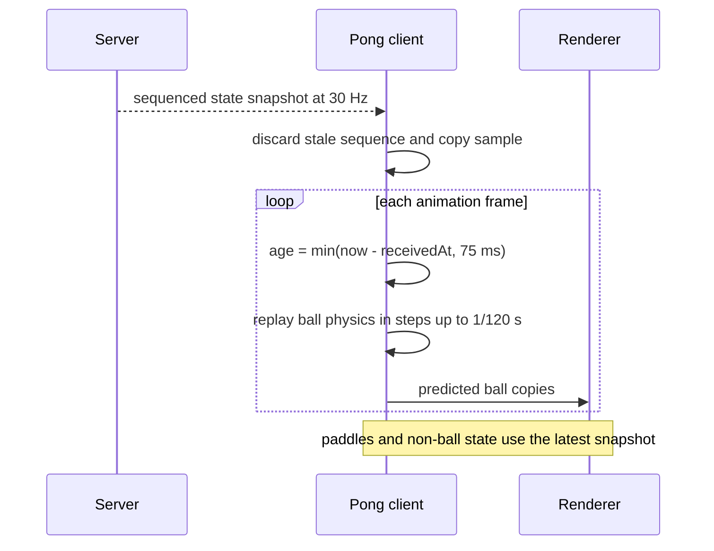
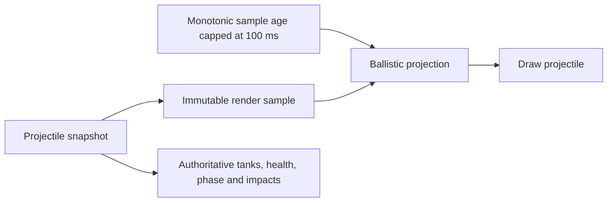

# Online rendering: smoothing and prediction

The server remains authoritative. Clients predict only transient render
positions between snapshots; commands, collisions, scores, damage, and turns
are never predicted. Every new snapshot replaces the client model and therefore
corrects accumulated visual error.



## Cadence and latency budget

| Game | Authority | Snapshot delivery | Client horizon |
|---|---|---|---|
| Pong | Server physics with steps up to 1/120 s | 30 Hz | 75 ms maximum |
| Battle Tanks | Server projectile physics at 60 Hz | 40 ms throttle: 25 Hz cap, typically about 20 Hz when sampled at 60 Hz | 100 ms maximum |
| Tic-tac-toe | Server validates discrete moves | Event-driven | None needed |

The horizon caps prevent a stalled or disconnected client from extrapolating
indefinitely. They are deliberately only a little longer than the normal
snapshot interval, so animation usually stays continuous while prediction error
remains bounded.

## Pong

On receipt, the client copies balls, paddles, effect state, authoritative match
elapsed time, and `performance.now()`. On every animation frame it predicts each
ball from that immutable sample by the smaller of sample age and 75 ms.



Prediction mirrors the relevant authoritative rules: velocity, slow-field
scaling and expiry, curve acceleration and duration, top/bottom wall rebounds,
paddle overlap and return velocity, and one-shot curve consumption. Prediction
clones balls and effects so rendering cannot mutate synchronized state. The next
snapshot may visibly snap the ball if the prediction lacked future information,
such as newly received input or an authoritative scoring event.

## Battle Tanks

Only a projectile in flight is extrapolated. Each state message replaces the
authoritative UI state and stores a projectile copy plus receipt time. Rendering
uses the closed-form ballistic position for at most 100 ms:

```text
x(t)  = x₀ + vx·t
y(t)  = y₀ + vy·t + ½g·t²
vy(t) = vy + g·t
```



The renderer does not run collision detection or resolve a shot. The server
broadcasts an immediate resolved state on collision, turn change, or game over;
that snapshot removes the predicted projectile and applies authoritative damage
and impact effects. This avoids duplicate impacts and incorrect client turns.

## Optimizations and safeguards

* `requestAnimationFrame` decouples display refresh from network cadence.
* Prediction starts from the newest copied snapshot rather than incrementally
  mutating the prior rendered position, preventing frame-rate-dependent drift.
* Pong uses bounded 1/120 s substeps to match collision behavior and avoid
  tunneling; Battle Tanks uses a cheap analytical trajectory because collision
  remains server-only.
* Server snapshots are throttled independently of render refresh to control
  bandwidth. Pong sends at 30 Hz; Battle Tanks sends only during projectile
  flight and immediately on resolution.
* Monotonic `performance.now()` measures local sample age without depending on
  client/server wall-clock synchronization.
* Sequence rejection protects Pong from out-of-order snapshots. Room lifecycle,
  pause, and reconnection still come from authoritative messages.

## Trade-offs and alternatives

| Approach | Benefit | Reason not currently used |
|---|---|---|
| Current short extrapolation | Low latency, little buffering, small change to authoritative design | Corrections can snap at unpredictable collisions or input changes |
| Snapshot interpolation with a render delay | Smooth motion and no future-state guessing | Adds at least one snapshot interval of visible latency; needs a timestamped buffer |
| Blend corrections over several frames | Hides small snapshot corrections | Temporarily renders a state known to be wrong and complicates collision/score transitions |
| Full client-side simulation and reconciliation | Immediate local response for all objects | Requires deterministic replay, input acknowledgements, rollback, and substantially more complexity |
| Higher snapshot rate | Smaller prediction gaps and corrections | Increases room bandwidth, serialization, and broadcast work |
| Lower snapshot rate plus richer velocity data | Reduces bandwidth | Lengthens prediction horizons and magnifies divergence at discontinuities |

The current design favors responsive visuals with bounded complexity. If network
jitter becomes the dominant problem, timestamped interpolation is the preferred
next experiment for remote objects. If input latency becomes dominant, add
sequence-numbered local input prediction and server reconciliation separately;
do not move authority for collisions or results into the browser.

