# Release process

JavaScript Playground has two release trains: an automatically updated alpha
train for continuous testing and a manually promoted stable train for users.
Code is integrated on `master`; stable releases are built only from the
protected `release` branch.

## Branches and promotion flow

```mermaid
flowchart LR
  Feature[Feature or fix branch] -->|pull request: test, audit, build, scan| Master["master<br/>integration branch"]
  Master -->|every accepted change| Alpha[Docker alpha + sha tag]
  Master -->|scheduled run| Nightly["Nightly test, build, scan<br/>no publishing"]
  Alpha -->|continuous testing| Decision{Ready to release?}
  Decision -->|no| Feature
  Decision -->|"promotion pull request<br/>master → release"| Release["release<br/>stable candidate branch"]
  Release -->|push validates only| Candidate["Validated candidate<br/>no stable image yet"]
  Candidate -->|"manual workflow<br/>matching SemVer"| Gates[Test, audit, build, scan]
  Gates --> GitTag[Create immutable vX.Y.Z tag]
  GitTag --> Stable[Docker latest, X.Y.Z, X.Y, sha]
  Stable --> Notes[GitHub Release + bundled release notes]
  GitTag -. tag retry .-> Retry["Republish X.Y.Z + sha only<br/>never move mutable tags backward"]
```



| Ref | Purpose | What a successful run publishes |
| --- | --- | --- |
| Feature/fix branch pull request | Review a proposed change | Nothing; it tests, audits, builds, and scans. |
| `master` | Integrate accepted work and feed continuous testing | `alpha` plus immutable `sha-...` on every push. |
| Scheduled run | Recheck the current default branch against current vulnerability data | Nothing. |
| `release` | Hold the exact stable candidate | A push only validates. A manual stable workflow publishes `latest`, `X.Y.Z`, `X.Y`, and `sha-...`. |
| `vX.Y.Z` | Identify one immutable released commit and safely retry interrupted work | Only immutable `X.Y.Z` and `sha-...` artifacts. It cannot move `latest`, `X.Y`, or GitHub's latest-release marker. |

`master` is expected to move continuously. `release` moves only when a
promotion pull request is reviewed and merged. Merging into `release` does not
publish a stable release by itself; the manual workflow is the final approval
point.

## Prepare and promote a stable release

1. Merge normal feature and fix pull requests into `master`. Each merge updates
   the alpha image after all quality gates pass.
2. Test the alpha deployment. Keep its database, hostname, container, port, and
   Compose project separate from stable.
3. On `master`, set the intended SemVer in `package.json` and `package-lock.json`.
   Add the matching newest entry to `releases.json`.
4. Open a promotion pull request with `master` as the head branch and `release`
   as the base branch. Review the accumulated changes and merge it.
5. Wait for the `release` push validation to pass. This run deliberately does
   not publish a stable image.
6. In GitHub, open **Actions → Publish stable release**, choose the `release`
   branch, select **Run workflow**, and enter the exact version without the `v`
   prefix—for example, `1.2.0`.
7. Confirm that Docker Hub contains `latest`, `1.2.0`, `1.2`, and the commit's
   `sha-...` tag, and that GitHub contains the matching `v1.2.0` tag and Release.
8. Pull and restart the stable NAS deployment when it is not updated
   automatically.

The stable workflow rejects a version that does not match both the package
version and newest release-notes entry. It repeats the tests, production
dependency audit, syntax checks, container build, and vulnerability scan before
creating the Git tag or changing Docker Hub.

## Write release notes

`releases.json` is the release record. Add the newest entry first and keep these
fields purposeful:

- `title` and `summary` introduce the release.
- `highlights` describe player-visible features and improvements.
- `fixes` describe player-visible corrections.
- `technical` records operator and engineering details.

Stable builds expose the title, summary, highlights, and fixes in the product.
They open automatically once per version in each browser and remain available
from the version button in the footer. The GitHub Release also includes the
technical notes. Alpha and development builds never present unpublished release
notes automatically.

Validate the manifest locally before promotion:

```sh
node scripts/release-notes.js validate
node scripts/release-notes.js validate 1.2.0
```

## Recover an interrupted release

The workflow creates and pushes `vX.Y.Z` before it changes public image tags.
If a later step fails, rerun **Publish stable release** from that exact version
tag and enter the same version. The workflow verifies that the tag identifies
the current commit.

A tag retry intentionally publishes only the immutable full-version and commit
image tags. This makes an old retry safe even after a newer release exists: it
cannot roll stable consumers back by changing `latest`, the major/minor tag, or
GitHub's latest-release marker. If a mutable pointer for the newest release
needs repair, rerun the workflow from the current `release` branch after
confirming that it still identifies that release.

## Run stable and alpha on a NAS

Use separate Compose project names so SQLite data is isolated. Also use
different container names, ports, and preferably hostnames because browser
cookies are scoped by hostname rather than port.

Example stable environment:

```dotenv
JSPG_IMAGE=YOUR_DOCKERHUB_USERNAME/js-playground:latest
JSPG_CONTAINER_NAME=javascript-playground-stable
JSPG_PORT=8080
ALLOWED_ORIGINS=https://play.example.com
```

Example alpha environment:

```dotenv
JSPG_IMAGE=YOUR_DOCKERHUB_USERNAME/js-playground:alpha
JSPG_CONTAINER_NAME=javascript-playground-alpha
JSPG_PORT=8081
ALLOWED_ORIGINS=https://alpha-play.example.com
```

Deploy them independently:

```sh
docker compose --env-file stable.env -p jspg-stable -f compose.nas.yaml pull
docker compose --env-file stable.env -p jspg-stable -f compose.nas.yaml up -d
docker compose --env-file alpha.env -p jspg-alpha -f compose.nas.yaml pull
docker compose --env-file alpha.env -p jspg-alpha -f compose.nas.yaml up -d
```

The distinct project names create distinct `arcade-data` volumes. Never point
alpha directly at stable's SQLite database. Before updating stable, back up its
volume; schema migrations run automatically at startup and are not designed to
be reversed by merely selecting an older image.

Following `latest` means a pull selects the newest stable release, while an
exact version such as `1.2.0` gives deliberate upgrades and a reproducible image.
Docker Compose does not poll the registry itself, so use the NAS scheduler or a
carefully configured updater if stable should pull and restart automatically.

## Repository protection

- Require pull requests and CI on both `master` and `release`.
- Block force pushes and branch deletion on both branches.
- Protect `v*` tags against updates and deletion while allowing the stable
  workflow to create them.
- Store Docker Hub credentials only in the `DOCKERHUB_USERNAME` and
  `DOCKERHUB_TOKEN` GitHub Actions secrets.
- Send urgent fixes through the same `master` → alpha test → promotion pull
  request → `release` workflow. Do not bypass the release train.

The architectural rationale is recorded in
[ADR 0026](adr/0026-controlled-release-trains.md). The workflow implementations
are `.github/workflows/container.yml` and `.github/workflows/release.yml`.
